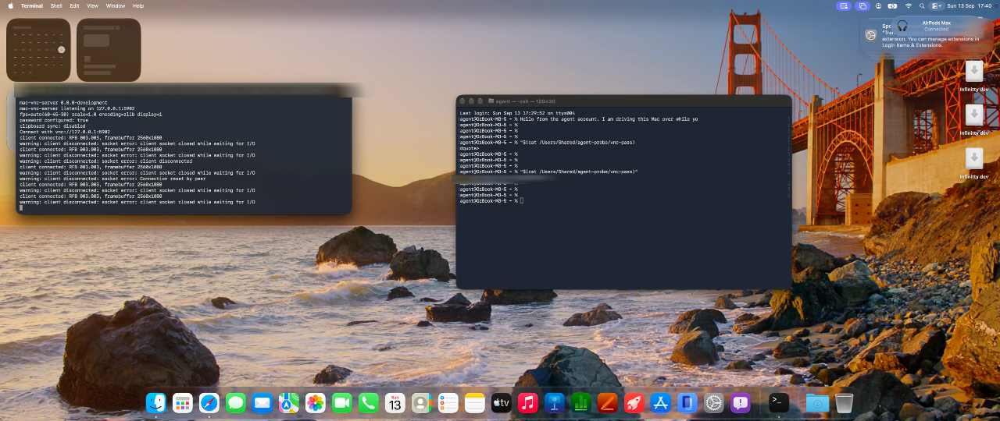

# agent-desktop

Give an AI agent its own macOS account to work in.

It gets a real desktop — a genuine login session, not a virtual framebuffer — and
can see and click there through computer use. You watch it live in a browser and
grab control whenever you want. Nothing it does lands on your own screen.



## Why a whole user account

The alternatives are worse. Driving your own desktop means fighting you for the
mouse. A VM means no real apps, no real logins, no real Keychain. A second macOS
account is the only thing that gives an agent somewhere real to work while
keeping a hard boundary around your own session — one macOS already enforces,
with per-account permissions you grant and revoke in System Settings.

## How the pieces fit

```
agent account (a real macOS login, running in the background)
├── agensis-cu          the hands: MCP server, screen capture + input
└── mac-vnc-server      the eyes: streams that desktop
        │
        └── noVNC in a browser (websockify, or the viewer app's built-in bridge)

the agent itself runs anywhere (Claude Code, Codex, a relay)
and reaches the hands over MCP
```

Two separate channels on purpose. The agent drives through MCP; you watch
through VNC. Watching never blocks the agent, and you can always see what it is
doing.

## Install

Prebuilt (signed + notarized): download
`AgentDesktop-<version>-arm64.dmg` from the repo's **Releases** page, drag
**Agent Desktop** to Applications, and launch it — skip the build steps below.

From source:

```
git clone <this-repo> agent-desktop
claude plugin marketplace add ./agent-desktop
claude plugin install agent-desktop@agent-desktop
```

Once it is pushed somewhere, `claude plugin marketplace add <owner>/<repo>`
replaces the clone step.

Then build everything (needs a Swift toolchain — install Xcode):

```
skills/agent-desktop-setup/scripts/install.sh
```

That builds the two hosts and **AgentUser.app**, and installs them into
`/Users/Shared/agensis`.

## Use

Open **AgentUser.app**. It is one app with three faces, chosen by the account
it is running in and how far setup has got, so there is never a question of
which tool to reach for next:

| where | what you get |
|---|---|
| your account, setup unfinished | the wizard |
| the agent's account | the permissions wizard |
| your account, setup finished | the viewer |

The wizard polls the real state, so a step goes green when it is actually
true — never because you told it so. Adding an agent creates the macOS account
for you: the app's "Add an agent" sheet asks for your administrator password
once (the standard macOS prompt), generates the account, and shows you a
random password to type once at the login screen. Two steps stay yours, and
it says why on each: only the real login window can start a desktop session,
and the agent's permissions are granted inside its own account.

Why an app rather than another script: running inside the agent's account it
can ask macOS for the permissions itself, so the dialogs appear in front of
you. It also opens the right System Settings pane **and** reveals the binary
in Finder beside it — `agensis-cu` and `mac-vnc-server` are plain executables,
and macOS often will not list them until one is dragged in. That is the step
people lose the most time to, with nothing on screen to say so.

The viewer wraps noVNC and signs in for you with the stored password, and has
an "I'm driving" switch for when you take over.

If you would rather be walked through it in the terminal, `/agent-desktop` does
the same sequence, and `SETUP.md` is the written version.

## The two steps that stay yours

- **Creating the account**, which needs admin rights.
- **Logging it in** via Fast User Switching, then switching straight back.
  No script can do this, and a reboot means doing it again. The backgrounded
  session keeps rendering, which is exactly what makes screen capture work.

Granting Screen Recording and Accessibility is also yours, but it happens
*inside* the agent account — easiest once the browser view is up.

Check status at any time:

```
skills/agent-desktop-setup/scripts/check-setup.sh
```

## What bounds the agent

Only the macOS permissions you grant to `agensis-cu` **inside that account**.
Deny Screen Recording and screenshots fail, loudly. Nothing here works around a
denial or second-guesses a grant. The account is standard, not admin, so the
agent cannot administer the machine.

The one rule the skills enforce hardest: **never send input into a session a
human is using.** If you are connected to that desktop through the viewer, input
lands in whatever window *you* have focused.

## Demo media

```
skills/agent-desktop-setup/scripts/capture-demo.sh still            # full display
skills/agent-desktop-setup/scripts/capture-demo.sh region           # pick an area
skills/agent-desktop-setup/scripts/capture-demo.sh video 30         # timed .mov
skills/agent-desktop-setup/scripts/capture-demo.sh gif demo.mov     # .mov -> .gif
```

`screencapture` records **your** screen, so this captures the story of watching
the agent — the browser view, you taking over. For an agent's-eye shot, ask the
agent for a `screenshot`; that comes from inside its session.

Check the frame before sharing: the VNC password shows up in terminal title bars.

## Contents

| path | what |
|---|---|
| `commands/agent-desktop.md` | the guided walkthrough |
| `skills/agent-desktop-setup/` | reference, scripts, failure signatures |
| `skills/driving-agent-desktop/` | how an agent should drive a desktop |
| `native/agensis-cu/` | the computer-use MCP host (Swift, MIT) |
| `native/AgentUser/` | the wizard and viewer app (SwiftUI) |
| `native/mac-vnc-server/` | the eyes — vendored from PabloZaiden/mac-vnc-server, see `VENDORED.md` |

`mac-vnc-server` is third-party
([PabloZaiden/mac-vnc-server](https://github.com/PabloZaiden/mac-vnc-server)),
vendored here so installs don't depend on the network — with one local patch:
input injection uses a session-scoped event tap so VNC input stays inside the
agent account (upstream routes it to the console session). Its built product is
`mac-vnc-server-dev`; everything here calls it `mac-vnc-server`.

## Gotchas worth knowing before they bite

- **`--encoding zlib` is mandatory.** The default ZRLE encoding crashes noVNC
  with "Too big index in palette".
- **Rebuilding a host silently drops its permissions** — grants attach to the
  binary signature. Re-running `install.sh` is safe: it signs both binaries
  with stable identifiers (`com.agentdesktop.*`), so the grant survives. A raw
  `swift build` + copy does not sign, and voids the grant.
- **A VNC login as the agent user can show you the *console* screen**, not the
  agent's own session. Everything looks fine until you compare the wallpaper.
  Always verify with a screenshot.
- **One VNC client at a time.** A human watching blocks another client, which is
  why the agent drives over MCP rather than VNC.
- **`/Users/Shared/agensis` is `1777` on purpose** — the agent account must be
  able to write `self-test.txt` there. The sticky bit stops it touching yours.

`skills/agent-desktop-setup/references/troubleshooting.md` has the rest, symptom
first.

## Editing this plugin

Claude Code installs from a **copy**, not a symlink, so edits here do nothing
until you resync:

```
claude plugin uninstall agent-desktop@agent-desktop
claude plugin install   agent-desktop@agent-desktop
```

The copy it actually loads is under
`~/.claude/plugins/cache/agent-desktop/agent-desktop/<version>/`, and
changes need a Claude Code restart.

The installer copies the directory as-is, so `rm -rf native/agensis-cu/.build`
before resyncing — otherwise 240MB of Swift build output lands in the cache.

Two schema traps, both discovered the hard way: `marketplace.json` needs
`plugins` as an **array**, and a local plugin's `source` must be a plain string
(`"./"`) — the object form is rejected as an unsupported source type.

## Licence

MIT. `mac-vnc-server` is separately licensed by its authors.
